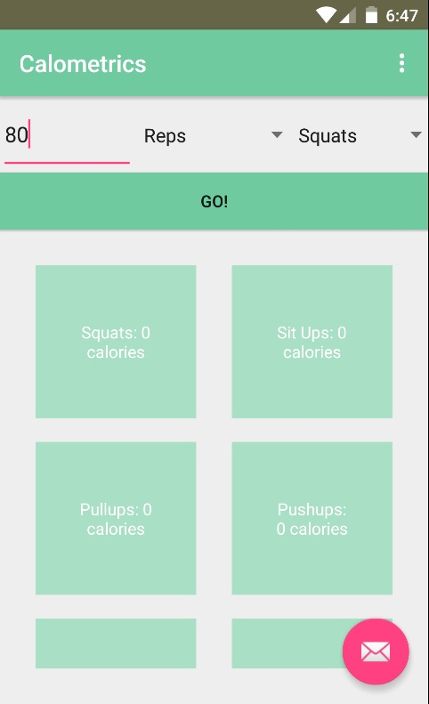
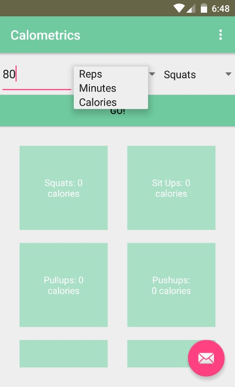
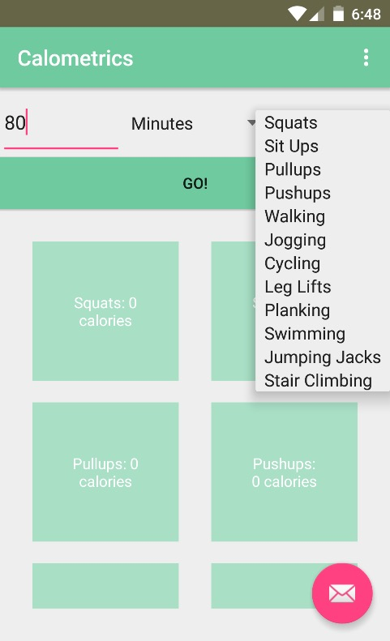
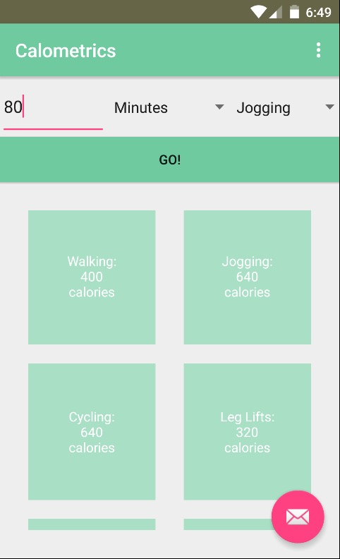

# PROG 01: Crunch Time

Briefly describe your app here.

## Authors

Sreesha Venkat ([sreeshavenkat@berkeley.edu](mailto:sreeshavenkat@berkeley.edu))

## Demo Video

See [CS 160 PROG 01: Calometrics] (https://www.youtube.com/watch?v=Foa0WHqo_18&feature=youtu.be)

## Screenshots

## Acknowledgments

* Hat tip to anyone who's code was used
* Any other support

*Feel free to enhance your README. For Markdown syntax, see [the GitHub Guides](https://guides.github.com/features/mastering-markdown/). Remove this line in your submission.*
